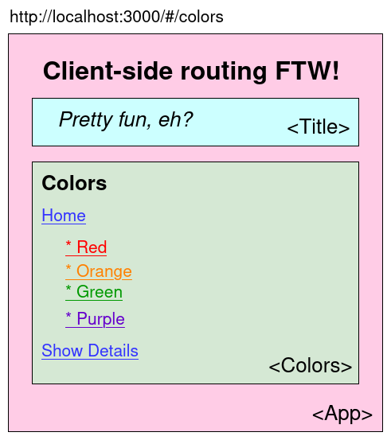

# Client-side routing with React Router

## Concepts

Why even have a client-side router?

* Browser history integration (back button functionality FTW)
* Much easier than conditionally displaying components
* URL representation (important for sharing)

## Code demo

1. Setup
1. Define a top-level route
1. Define a route that accepts props
1. Define a route that includes a param
1. Create a link to a route
1. Embed a nested route

### Setup

* Install `react-router-dom`

  ```sh
  npm i react-router-dom
  ```

* Wrap the `Router` around your top-level component (`App`)

  ```js
  // client/index.js
  import React from 'react'
  import ReactDOM from 'react-dom'
  import { BrowserRouter as Router } from 'react-router-dom'

  import App from './components/App'

  document.addEventListener('DOMContentLoaded', () => {
    ReactDOM.render(
      <Router>
        <App />
      </Router>,
      document.getElementById('app')
    )
  })
  ```

### Define a top-level route

```js
// client/components/App.jsx
import React from 'react'
import { Routes, Route } from 'react-router-dom'

import Home from './Home'

const App = () => {
  return (
    <>
      <h1>Routing is so fun!</h1>
      <Title />
      <Routes>
        <Route path='/' element={ <Home /> }/>
      </Routes>
    </>
  )
}
```

### Define a route that accepts props

```diff
import Home from './Home'
import Food from './Food'

+ const foodData = ['ice cream', 'pizza', 'burger', 'wings']

const App = () => {
  return (
    <>
      <h1>Routing is so fun!</h1>
      <Title />
      <Routes>
        <Route path='/' element={ <Home /> }/>
        <Route path='/colors' element={ <Colors data={colorsData} /> } />
      </Routes>
    </>
  )
}
```

### Define a route that includes a param

```diff
import Home from './Home'
+ import Products from './Products'

const App = () => {
  return (
    <>
      <h1>Routing is so fun!</h1>
      <Title />
      <Routes>
        <Route path='/' element={ <Home /> }/>
        <Route path='/colors' element={ <Colors data={colorsData} /> } >
          <Route path=':details' element={ <Details/> } />
        </Route>
        <Route path='/color/:name' element={ <Color /> } /> 
      </Routes>
    </>
  )
}
```

To see how to get the `id` see the _Embed a route_ sample below.

### Create a link to a route

```diff
// client/components/Products.jsx
import React from 'react'
+ import { Link } from 'react-router-dom'

const Products = () => {
  return (
    <>
      <h1>Products</h1>

      <!-- More stuff here of course -->

+     <Link to="/">Back home</Link>
    </>
  )
}
```

### Embed a nested route

```diff
// client/components/Product.jsx
import React from 'react'
+ import { Outlet, Link, useParams } from 'react-router-dom'

+ import ProductDetails from './ProductDetails'

const Product = (props) => {
  const { id } = useParams()
  // OR const { id } = props.match.params

  return (
    <>
      <h1>Product</h1>
      <!-- Description goes here -->

+     <Link to={`/products/${id}/details`}>Show Details</Link>
      <Outlet />

      <Link to="/">Back home</Link>
    </>
  )
}
```

## What we're building





