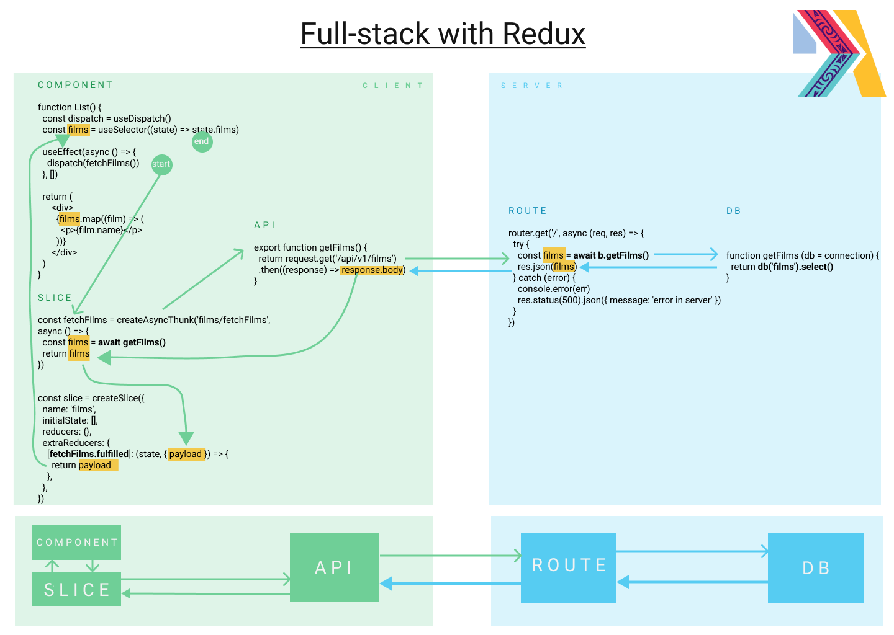

# Async Calls with Redux

## Lecture Notes
* Async things take a while...
* We should let the user know something is happening
    * Busy indicator
    * Disabled buttons

## Demo

* Code walkthrough
  * redux-toolkit
  * framer-motion
  * tailwindcss
* Verify API route with Insomnia
* Dispatch an async action (side-effect) to list/get films 
* Dispatch an async action to add a new film
* Show busy indicator while waiting for API responses

## Redux Diagrams

